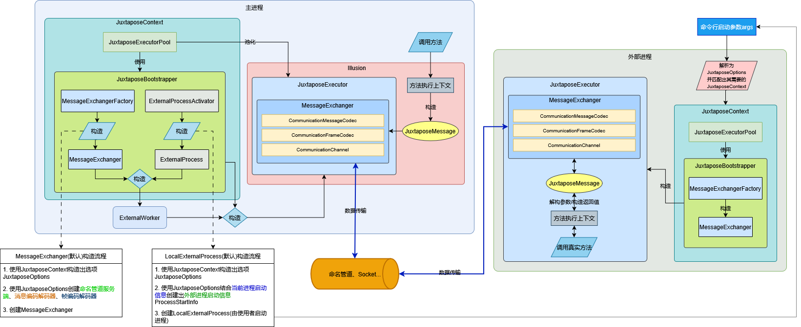

# Juxtapose
## 1. Intro
A multi process runtime library based on 'SourceGenerator'.
基于 `SourceGenerator` 的多`进程`运行库。

## 2. Features
 - 可以为`类型`、`接口`、`静态类`生成代理，无需手动编写RPC相关代码，即可`多进程`运行；
 - 编译时生成所有代码，运行时无显式的反射调用和动态构造；
 - 支持`委托`和`CancellationToken`类型的方法参数（其余类型未特殊处理，将会进行序列化，目前回调`委托`不支持嵌套和`CancellationToken`）；
 - 支持`Linux`、`Windows`（其它未测试）；
 - 支持调试子进程（`Windows`&&`VisualStudio` Only）；
 - AOT支持*（net8.0+）；										

### 注意事项
 - 目前参数不支持定义为父类型，实际传递子类型，序列化时将会按照定义的类型进行序列化和反序列化，会导致具体类型丢失；
   - 使用默认序列化配置时，可以通过配置 [序列化派生类](https://learn.microsoft.com/zh-cn/dotnet/standard/serialization/system-text-json/polymorphism) 来支持此功能
 - 目前所有的参数都不应该在方法完成后进行保留，`CancellationToken`、`委托`等在方法完成后会被释放；

## 3. Requirement
 - .Net8.0+(其它版本没有尝试过)

## 4. 使用方法

### 4.1 引用包
```XML
<ItemGroup>
  <PackageReference Include="Juxtapose" Version="1.5.4" />
</ItemGroup>
```

------

### 4.2 建立上下文

#### 4.2.1 创建上下文类型，并使用 `[Illusion]` 特性指定要生成的类型

```C#
[Illusion(typeof(Greeter), "Juxtapose.Test.GreeterAsIGreeterIllusion")]
public partial class GreeterJuxtaposeContext : JuxtaposeContext
{
}
```
示例代码将为`Greeter`生成代理类型`Juxtapose.Test.GreeterAsIGreeterIllusion`；
  
Note!!!
 - 必须继承`JuxtaposeContext`；
 - 必须标记`partial`关键字；

------

#### 4.2.2 `[Illusion]` 的多种用法

 - 直接为类型生成代理，如下示例生成 `Juxtapose.Test.GreeterIllusion` 类型，且不继承接口（静态类型相同用法）
  ```C#
  [Illusion(typeof(Greeter))]
  ```

 - ~~为类型生成代理，并继承指定接口，如下示例生成 `Juxtapose.Test.GreeterAsIGreeterIllusion` 类型且继承`IGreeter`接口~~
	- 现在需要手动声明 `partial` 类来使生成的类型派生自目标接口
  ```C#
  partial class GreeterIllusion : IGreeter
  { }
  ```

 - 生成类型，并指定类型名称，如下示例生成 `Juxtapose.Test.HelloGreeter` 类型
  ```C#
  [Illusion(typeof(Greeter), generatedTypeName: "Juxtapose.Test.HelloGreeter")]
  ```

 - 生成从IoC容器获取的接口代理类型，如下示例生成 `Juxtapose.Test.IGreeterIllusionFromIoCContainer` 类型（此时Context类需要实现`IIoCContainerProvider`接口，并提供有效的`IServiceProvider`）
  ```C#
  [Illusion(typeof(IGreeterFromServiceProvider), generatedTypeName: "Juxtapose.Test.IGreeterIllusionFromIoCContainer", fromIoCContainer: true)]
  ```

------

### 4.3 添加入口点
在`Main`方法开始处添加入口点代码，并使用指定上下文
```C#
await JuxtaposeEntryPoint.TryAsEndpointAsync(args, GreeterJuxtaposeContext.SharedInstance);
```

------

#### 到此已完成开发，创建类型`Juxtapose.Test.GreeterAsIGreeterIllusion`的对象，并调用其方法，其实际逻辑将在子进程中运行；


## 5. 调试、诊断子进程

### 5.1 调试子进程（`Windows`&&`VisualStudio` Only）

现在会自动附加调试器（启动项目需要直接引用`Juxtapose`包，以确保依赖包正确引入）

#### 在代码中打上断点，运行时将会正确命中断点（只在 `VisualStudio2022 17.0.5` && `Win11 21TH2` 中进行了测试，理论上是通用）

### 5.2 诊断子进程

使用默认外部进程激活器时，默认情况下子进程的诊断会被关闭 (`dotnet-dump`等会无法运行)，以避免生成过多诊断支持文件，可以通过如下方式开启子进程诊断:
- 显式设置环境变量 [DOTNET_EnableDiagnostics](https://learn.microsoft.com/zh-cn/dotnet/core/runtime-config/debugging-profiling)
- 设置 `LocalExternalProcessActivator.EnableDotnetDiagnostics` 为 `true`

------

## 6. AOT支持*（net8.0+）

#### 受限于代码生成器不能相互访问生成的代码，AOT支持需要手动编写部分代码

 - 声明 JsonSerializerContext
  框架默认使用 `System.Text.Json` 进行消息的序列化与反序列化，需要手动定义 `JsonSerializerContext` 声明所有类型:
  ```
  [JsonSerializable(typeof(global::Juxtapose.Messages.JuxtaposeAckMessage))]
  [JsonSerializable(typeof(global::Juxtapose.Messages.ExceptionMessage))]
  [JsonSerializable(typeof(global::Juxtapose.Messages.InstanceMethodInvokeMessage<global::Juxtapose.Messages.ParameterPacks.CancellationTokenSourceCancelParameterPack>))]
  [JsonSerializable(typeof(global::Juxtapose.Messages.DisposeObjectInstanceMessage))]
  [JsonSerializable(typeof(global::Juxtapose.Messages.CreateObjectInstanceMessage<global::Juxtapose.Messages.ParameterPacks.ServiceProviderGetInstanceParameterPack>))]
  // .........
  [JsonSourceGenerationOptions(IgnoreReadOnlyProperties = false, IgnoreReadOnlyFields = false, IncludeFields = true, WriteIndented = false)]
  partial class SampleJsonSerializerContext : JsonSerializerContext {}
  ```

 - 重写 `JuxtaposeContext` 的 `CreateCommunicationMessageCodecFactory` 方法
  应用前置步骤声明的 `JsonSerializerContext`
 ```
  partial class SampleJuxtaposeContext : global::Juxtapose.JuxtaposeContext
  {
    protected override ICommunicationMessageCodecFactory CreateCommunicationMessageCodecFactory()
    {
        var communicationMessageCodec = new DefaultJsonBasedMessageCodec(GetMessageTypes(), LoggerFactory, SampleJsonSerializerContext.Default.Options);
        return new GenericSharedMessageCodecFactory(communicationMessageCodec);
    }
  }
 ```

#### 至此已完成AOT支持；

#### Note: 为方便开发，上述代码已生成在 `Context` 代码中，可从分析器中找到代码，复制后可直接使用；
#### Note: 已经过有限的测试；

------

## 7. 工作逻辑
`SourceGenerator`在编译时生成代理类型，封装通信消息。在创建代理类型对象时，会自动创建子进程，并在子进程中创建目标类型的对象，使用命名管道进行进程间通信，使用`System.Text.Json`进行消息的序列化与反序列化。

### 7.1 关键词列表
|关键字|名称|来源|作用|
|----|----|----|----|
|Context|上下文|手动定义|用于承载所有子进程运行的相关信息|
|Executor|执行器|自动生成|用于运行时消息解析收发，创建对象，执行静态方法等|
|ParameterPack|参数包|自动生成|将方法参数封装到一个类型中，以便序列化|
|Illusion|幻象|自动生成|实际使用的类|
|RealObjectInvoker|真实对象执行器|自动生成|在子进程中接收消息，并进行实际的对象方法调用|

### 7.2 架构图


## 更多功能细节参见示例代码

----

### 示例列表

|       项目        |       内容        |
| ---------------- | ---------------- |
|SampleLibrary|基于库的使用示例，可由其它程序直接使用|
|SampleConsoleApp|基于控制台的使用示例，可使用当前程序集生成的类，或使用其他库生成的类|
|ResourceBasedObjectPool|基于系统资源的动态对象池示例|
